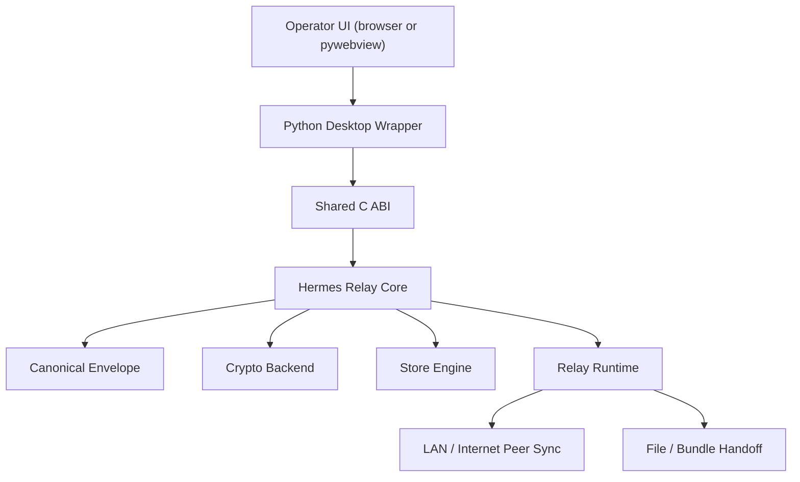

# Hermes Relay

Hermes Relay is an offline-first, crisis-resilient messaging protocol and portable C implementation for very short end-to-end encrypted messages that can move across degraded environments without relying on central infrastructure.

Landing page:

- [Hermes Relay project site](https://benjaminrathelot.github.io/Hermes-Relay/)

Its purpose is simple:

- a sender creates an encrypted message for one recipient
- that message can pass through several relays
- those relays can exchange traffic over LAN, local Wi-Fi, partial Internet links, file import/export, or physical transport of a device
- the recipient does not need to be online when the message is created
- delivery may happen minutes, hours, or days later

The core idea is not instant messaging. The core idea is delayed but resilient communication in hostile or degraded conditions.

> Public repo, source available, non-commercial.
> This repository is licensed for non-commercial use only under PolyForm Noncommercial 1.0.0.

Project landing page:

- [Hermes Relay GitHub Pages site](https://benjaminrathelot.github.io/Hermes-Relay/)

## Why Hermes Relay Exists

Hermes Relay is designed for the case where ordinary communication infrastructure is degraded, intermittent, locally available only in parts, or absent entirely.

Typical scenarios include:

- war or occupation environments
- severe weather events
- large-scale infrastructure outages
- isolated shelters or field teams
- geographically split zones where some areas still have Internet and others do not

It is built around a narrow, deliberate model:

- one sender
- one recipient
- short text only
- no groups
- no attachments
- no trusted server
- no blockchain
- no global consensus
- no guaranteed delivery
- store-carry-forward propagation

The goal is not rich messaging. The goal is to preserve basic human communication under stress, even when the path between sender and recipient is indirect and slow.

## How Hermes Relay Works

Hermes Relay uses store-carry-forward propagation.

That means a message does not need one continuous live network path from sender to recipient. Instead:

1. a sender creates one encrypted envelope for one recipient
2. a local client or relay stores that envelope
3. when another relay, device, or workstation becomes reachable, it can transfer the envelope
4. that next node stores it and later forwards it again
5. eventually the envelope reaches a device that can decrypt it for the intended recipient

The transfer step can happen in several ways:

- direct LAN sync
- local Wi-Fi or hotspot sync
- relay-to-relay sync over Internet where available
- file import and export
- USB transfer
- physical transport of a laptop, phone, relay box, or storage device acting as the messenger

This is why Hermes Relay remains useful even if:

- there is no Internet at all
- only some geographic areas have Internet
- the sender and recipient never overlap online at the same time
- the message has to cross several disconnected islands before arrival

In practical terms, Hermes Relay is meant to let communities build a communication fabric out of whatever links still exist.

## User Model

The intended end-user experience is simpler than the network behavior underneath it.

For the user:

- create an identity with a public/private key pair
- add contacts
- write a short message to one recipient
- receive and read messages addressed to that identity

For the relay layer:

- discover contact opportunities
- exchange inventories
- request missing envelopes
- verify signatures and proof of work
- deduplicate traffic
- store valid messages
- continue diffusing them opportunistically

In other words, the user should communicate. The relays should do the spider work.

Hermes Relay V1 keeps the communication model intentionally narrow:

- one message
- one sender
- one recipient
- one recipient public key target

That narrow model is part of what makes the protocol easier to audit, relay, and implement across difficult environments.

## What This Repository Contains

This repository includes:

- a normative V1 protocol specification
- a threat model
- a portable C core library
- a crypto abstraction layer
- a flat-file storage engine
- a defensive canonical envelope parser and serializer
- a CLI for identities, messages, bundles, and relay operations
- an integrated relay service with addressbook, logs, heartbeat, and recovery behavior
- a Python wrapper with a local desktop shell
- a simulator for propagation and pressure scenarios
- unit tests and a fuzz harness
- CMake and direct build scripts

Today, operators can use the protocol through:

- the CLI
- the integrated relay service
- the desktop shell

The next major goal is mobile integration so that small devices can carry, store, and relay large numbers of short encrypted messages in the same network model with less operator effort.

## Design Principles

- offline-first
- transport-agnostic
- minimal dependencies
- defensive parsing
- canonical wire format
- no plaintext on the wire
- no required Internet bootstrap
- no trust in relay metadata
- practical crisis operations over idealized network assumptions

## Core Capabilities

### Protocol

- strict canonical binary envelope format
- fixed interoperable cryptographic suite for V1
- sender signatures
- recipient-bound encryption
- portable proof of work
- bounded TTL
- deduplication by envelope ID and content hash

### Relay

- integrated foreground relay service
- persistent peer addressbook
- auto-learning of peers after successful relay contact
- structured rotating logs
- heartbeat status file
- import and export directories for file handoff
- periodic sync and cleanup loops
- designed for multi-hop relay chains rather than single-hop delivery assumptions

### Desktop Layer

- shared C ABI suitable for wrappers
- Python wrapper around the native ABI
- local-only desktop shell over `127.0.0.1`
- identity, contact, compose, inbox/store, bundle, and relay controls
- best-effort LAN/Internet/offline posture hints for operators

Current operator workflow:

- set up one or more relays
- create and carry traffic through the desktop application and relay nodes
- move bundles or let relays sync whenever contact becomes possible
- rely on the relay layer to continue spreading valid traffic without manual per-hop routing decisions

Planned next workflow:

- mobile applications that participate in the same protocol
- phones and other small devices acting as message carriers and relays
- more practical field use without requiring a laptop at every hop

## Architecture



## Interoperable Crypto Suite

Hermes Relay V1 fixes one suite so independent implementations can interoperate:

- signatures: Ed25519
- recipient encryption: X25519 + HKDF-SHA256 + ChaCha20-Poly1305
- hashing: SHA-256
- proof-of-work hash: SHA-256

The active backend in this repository is OpenSSL 3 EVP. The wire format is backend-neutral so another implementation, such as libsodium, can target the same bytes later.

## Safety And Hardening

The native core was written with defensive constraints in mind:

- explicit lengths instead of implicit string handling
- envelope and payload size ceilings
- canonical parse paths with exact bounds checks
- no raw struct dumps onto the network
- no host-endian wire encoding
- no custom cryptography
- malformed envelope rejection as early as possible
- platform abstraction around sockets, files, and service control
- optional AddressSanitizer and UndefinedBehaviorSanitizer builds
- compiler hardening flags enabled by default in CMake

## Repository Layout

- `docs/protocol-spec.md`
- `docs/threat-model.md`
- `docs/architecture.md`
- `docs/operator-quickstart.md`
- `docs/cli-guide.md`
- `docs/python-wrapper.md`
- `docs/desktop-shell.md`
- `docs/desktop-packaging.md`
- `docs/emergency-relay-playbook.md`
- `docs/relay-node.md`
- `docs/service-operations.md`
- `docs/storage-and-relay-policy.md`
- `docs/simulator-and-operations.md`
- `include/hermes/`
- `src/`
- `python/`
- `tests/`
- `fuzz/`
- `packaging/`

## Quick Start

Preferred build:

```sh
cmake -S . -B build
cmake --build build
ctest --test-dir build
```

Direct build helper:

```sh
./scripts/build.sh
./build/hermes-test
./tests/test_relay_service.sh
```

The direct build helper currently expects OpenSSL 3 under `/opt/homebrew/opt/openssl@3` on macOS/Homebrew systems.

## CLI Examples

Generate identities and contacts:

```sh
./build/hermes-cli genid --identity alice.id --alias alice
./build/hermes-cli export-contact --identity alice.id --out alice.contact
./build/hermes-cli genid --identity bob.id --alias bob
./build/hermes-cli export-contact --identity bob.id --out bob.contact
```

Create, verify, and decrypt a message:

```sh
./build/hermes-cli create \
  --identity alice.id \
  --contact bob.contact \
  --store ./alice-store \
  --message "Meet at well 18:00" \
  --out msg.bin

./build/hermes-cli verify --envelope msg.bin
./build/hermes-cli decrypt --identity bob.id --envelope msg.bin
```

Operate an integrated relay:

```sh
./build/hermes-cli relay-init --root ./relay-a --listen 0.0.0.0:9440
./build/hermes-cli relay-add-peer --root ./relay-a --peer 192.168.1.44:9440 --alias neighbor
./build/hermes-cli relay-run --root ./relay-a
./build/hermes-cli relay-status --root ./relay-a
```

## Desktop Shell

The Python desktop shell provides an operator console for:

- local identities
- contact import
- message composition
- store inspection and decrypt-by-envelope-id
- bundle import and export
- integrated relay start, stop, peer management, sync, and status
- local network posture guidance

Start it with:

```sh
PYTHONPATH=python/src python3 -m hermes_desktop serve-ui --open-browser
```

## Operational Scope

Hermes Relay is meant to degrade gracefully across:

- local Wi-Fi and LAN
- desktops
- Raspberry Pi and small relay boxes
- USB and file transfer
- partial Internet bridging where available
- physically carried devices that move messages between disconnected places

Future transport work can target Bluetooth, Wi-Fi Direct, LoRa, QR chunking, OpenWRT routers, and mobile-specific platform adapters without changing the protocol core.

## Documentation Map

- Start with `docs/operator-quickstart.md` for first use.
- Read `docs/protocol-spec.md` for the wire format.
- Read `docs/threat-model.md` for security assumptions.
- Read `docs/service-operations.md` for relay runtime behavior.
- Read `docs/emergency-relay-playbook.md` for crisis deployment patterns.
- Read `docs/python-wrapper.md` and `docs/desktop-shell.md` for the desktop layer.

## Status

This repository is a serious V1 engineering baseline, not a polished mass-market messenger.

What is already here:

- protocol
- parser and serializer
- crypto backend
- store engine
- relay service
- simulator
- CLI
- Python wrapper
- local desktop shell

What is intentionally still separate or later work:

- mobile applications
- richer GUI conversation UX
- Bluetooth and QR transports
- aggressive Wi-Fi roaming logic
- broader interoperability testing across independently written implementations

Mobile integration is a major next step. The long-term intent is that phones and other small devices will not only read and create messages, but also carry and relay them across damaged or fragmented networks with the same protocol.

## Ownership

Licensor and copyright holder:

- Benjamin Rathelot

Additional required notice is provided in `NOTICE`.

## License

Copyright (c) 2026 Benjamin Rathelot.

This repository is licensed under PolyForm Noncommercial 1.0.0. Commercial use is not permitted under the public repository license.

That means this repository is source-available, but it is not an OSI-approved open source project.
